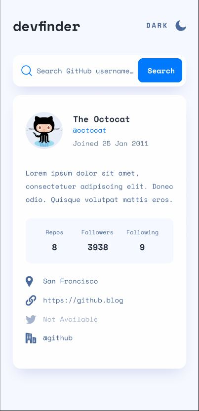
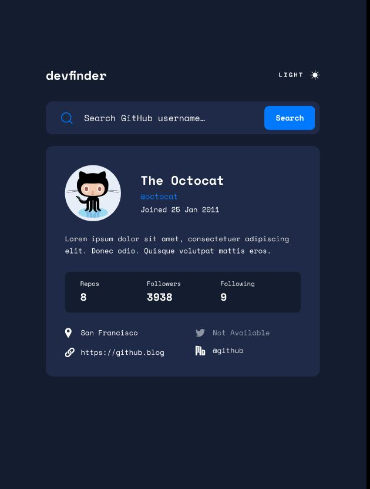
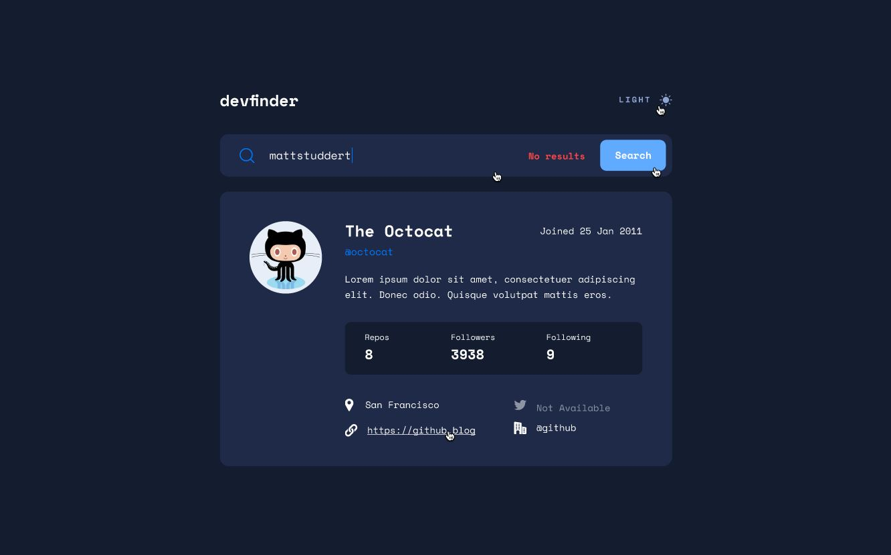

# Frontend Mentor - GitHub user search app solution

This is a solution to the [GitHub user search app challenge on Frontend Mentor](https://www.frontendmentor.io/challenges/github-user-search-app-Q09YOgaH6). Frontend Mentor challenges help you improve your coding skills by building realistic projects. 

## Table of contents

- [Overview](#overview)
  - [The challenge](#the-challenge)
  - [Screenshot](#screenshot)
  - [Links](#links)
- [My process](#my-process)
  - [Built with](#built-with)
  - [What I learned](#what-i-learned)
  - [Useful resources](#useful-resources)
- [Author](#author)

## Overview

### The challenge

Users should be able to:

- View the optimal layout for the app depending on their device's screen size
- See hover states for all interactive elements on the page
- Search for GitHub users by their username
- See relevant user information based on their search
- Switch between light and dark themes
- Have the correct color scheme chosen for them based on their computer preferences.
- Have the correct color scheme chosen for them based on their previous settings.

### Screenshot

Mobile View: 

Tablet View (Dark): 

Desktop View (Active): 

### Links

- Solution URL: [Add solution URL here](https://your-solution-url.com)
- Live Site URL: (https://fatimamushtaq29.github.io/github-user-search-app/)

## My process

### Built with

- Semantic HTML5 markup
- CSS custom properties
- Flexbox
- SCSS/SASS
- Mobile-first workflow

### What I learned

I learned about CSS media query "prefers-color-scheme" and how to use it to have the correct color scheme chosen based on computer preferences. Also learned about localStorage.

### Useful resources

- [Linearly Scale font-size with CSS clamp() Based on the Viewport](https://css-tricks.com/linearly-scale-font-size-with-css-clamp-based-on-the-viewport/) - This helped me understand clamp() property and how to linearly increase font-size, padding and margin.
- [Get your stylesheets more organized with Sass partials](https://www.youtube.com/watch?v=9Ld-aOKsEDk) - This is a youtube guide by Kevin Powell to get your stylesheets organized for better maintenance and scaling of your project.
- [Responsive Web Design: Dark Mode with HTML, CSS & JS](https://www.youtube.com/watch?v=eAqbvaUOj08&t=1793s) - A youtube tutorial by "Lost in the Source" to implement dark mode on your site with 'prefers-color-scheme' and 'localStorage'.

## Author

- Github - [Fatima Mushtaq](https://github.com/fatimamushtaq29)
- Frontend Mentor - [fatimamushtaq29](https://www.frontendmentor.io/profile/fatimamushtaq29)
- LinkedIn - [Fatima Mushtaq](https://www.linkedin.com/in/fatima-mushtaq-2aa733107/)
